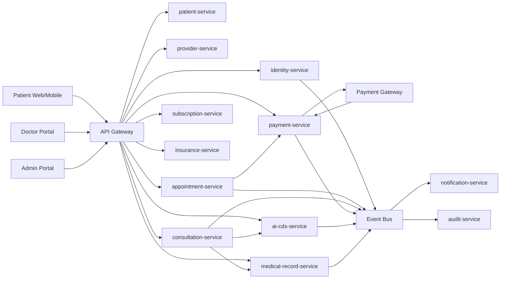
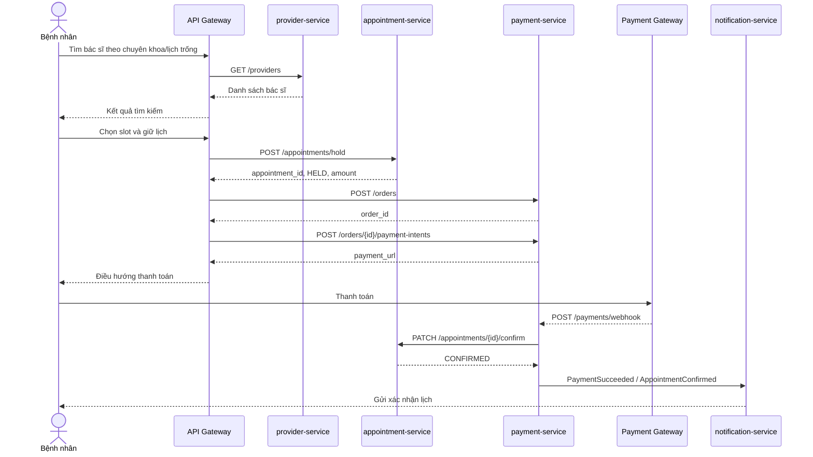
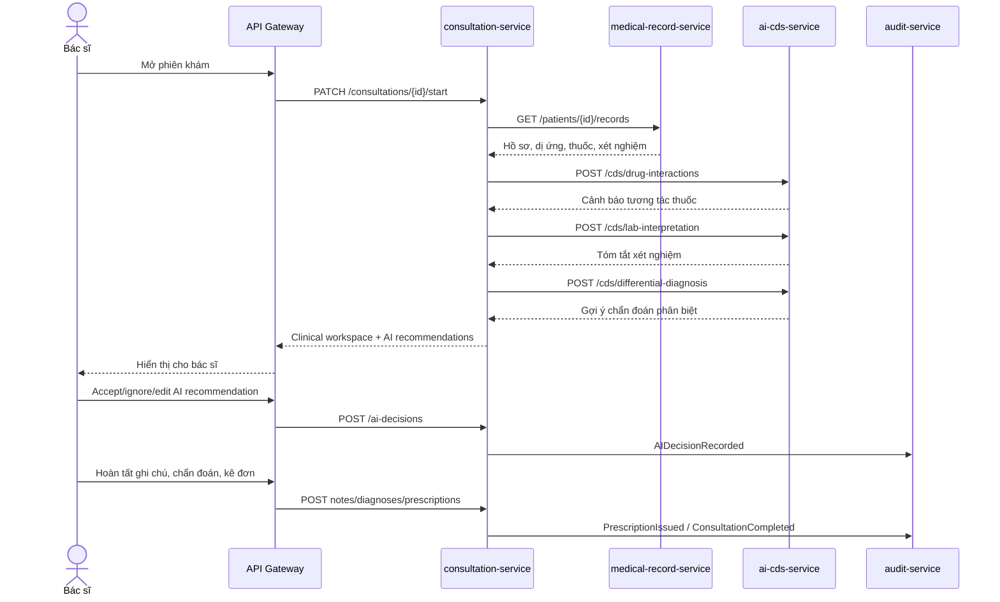
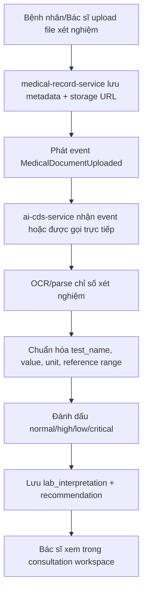
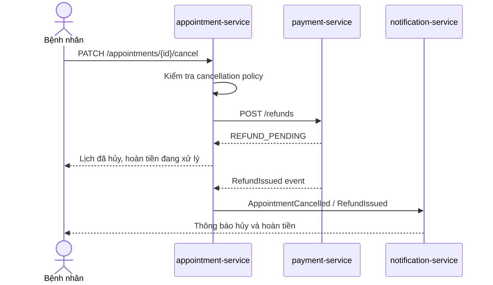
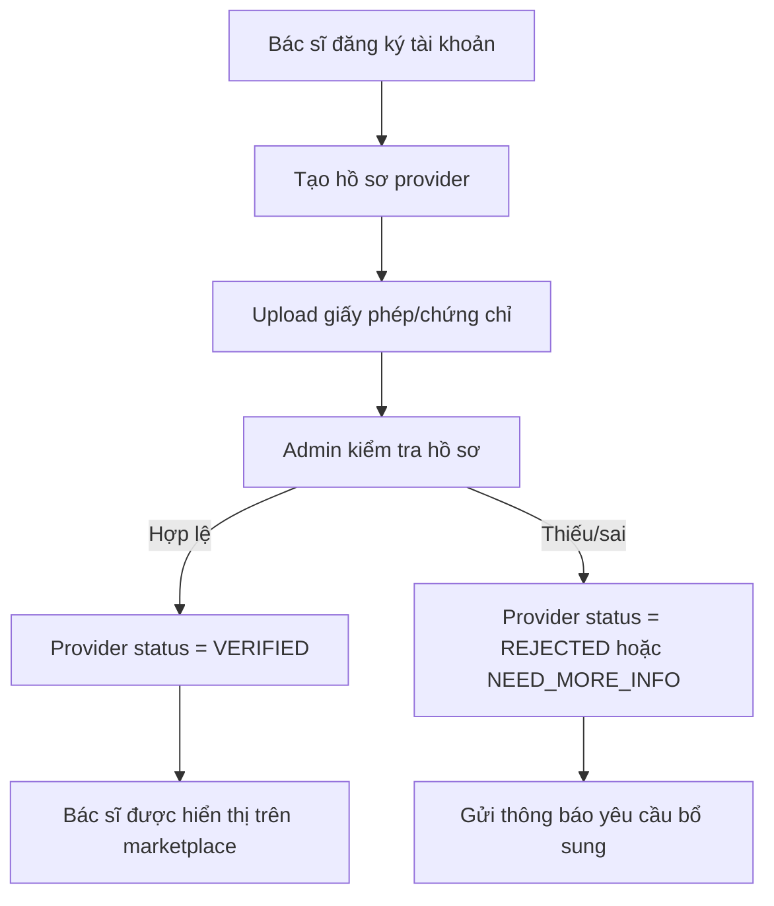

# Tài liệu phân tích, kiến trúc và API

## Hệ thống Healthcare Marketplace tư vấn người bệnh dựa trên Microservices và AI CDS

**Phiên bản:** 1.0  
**Thị trường triển khai đầu tiên:** Việt Nam  
**Mô hình sản phẩm:** Marketplace kết nối bệnh nhân với nhiều bác sĩ/phòng khám  
**Mô hình thanh toán:** Pay-per-visit trong MVP; subscription và bảo hiểm ở phase sau  
**AI CDS trong MVP:** Tương tác thuốc, đọc kết quả xét nghiệm, hỗ trợ chẩn đoán phân biệt cho bác sĩ  

> Lưu ý nghiệp vụ: AI CDS là công cụ hỗ trợ bác sĩ ra quyết định, không thay thế bác sĩ, không tự chẩn đoán cuối cùng và không tự kê đơn cho bệnh nhân.

---

## 1. Phạm vi MVP

### 1.1. Có trong MVP

- Đăng ký/đăng nhập bệnh nhân, bác sĩ, admin.
- Marketplace tìm kiếm bác sĩ theo chuyên khoa, giá, lịch trống.
- Đặt lịch khám/tư vấn online hoặc offline.
- Thanh toán online theo từng lượt khám.
- Quản lý hồ sơ bệnh nhân cơ bản.
- Quản lý hồ sơ bác sĩ, xác minh bác sĩ bởi admin.
- Phiên tư vấn, ghi chú khám, chẩn đoán, kê đơn.
- Upload tài liệu y tế và kết quả xét nghiệm.
- AI CDS hỗ trợ bác sĩ:
  - Cảnh báo tương tác thuốc.
  - Cảnh báo dị ứng/chống chỉ định cơ bản.
  - Đọc/diễn giải kết quả xét nghiệm cơ bản.
  - Gợi ý chẩn đoán phân biệt ở mức tham khảo.
- Notification qua email/SMS/push tùy tích hợp.
- Audit log truy cập dữ liệu y tế.

### 1.2. Chưa nên làm full trong MVP

- Subscription đầy đủ.
- Tích hợp bảo hiểm/claim tự động.
- AI tự tư vấn độc lập cho bệnh nhân.
- AI tự kê đơn hoặc đưa ra chẩn đoán cuối cùng.
- Tích hợp sâu với EMR/EHR bên ngoài.

---

## 2. User roles

| Role | Mô tả | Quyền chính |
|---|---|---|
| Bệnh nhân | Người đặt lịch, thanh toán, tư vấn, xem hồ sơ | Quản lý hồ sơ cá nhân, đặt lịch, thanh toán, xem bệnh án |
| Bác sĩ | Người tư vấn, chẩn đoán, kê đơn | Quản lý lịch, xem hồ sơ bệnh nhân được cấp quyền, ghi chú khám, xem AI CDS |
| Admin Marketplace | Vận hành toàn nền tảng | Quản lý user, bác sĩ, giao dịch, khiếu nại, dashboard |
| Provider Admin | Quản lý phòng khám/nhóm bác sĩ | Quản lý bác sĩ, lịch làm việc, giá dịch vụ |
| Finance Admin | Quản lý tiền | Đối soát thanh toán, refund, payout |
| Compliance/Security Admin | Kiểm soát tuân thủ | Audit log, quyền truy cập, consent, incident |
| AI CDS System | Actor hệ thống | Sinh cảnh báo, gợi ý, tóm tắt, log recommendation |
| Payment Gateway | Hệ thống ngoài | Xử lý thanh toán và gửi webhook |

---

## 3. Kiến trúc tổng quan



### 3.1. Nguyên tắc kiến trúc

- Mỗi microservice sở hữu database riêng.
- Giao tiếp đồng bộ qua REST API cho luồng cần phản hồi tức thời.
- Giao tiếp bất đồng bộ qua event bus cho notification, audit, payment reconciliation, AI feedback.
- API Gateway chịu trách nhiệm routing, auth enforcement, rate limit.
- Audit log là append-only, không cho sửa/xóa trực tiếp.
- AI CDS phải có model version, prompt version và recommendation log.

---

## 4. Service boundaries và database sơ bộ

| Service | Trách nhiệm | Database | Bảng chính |
|---|---|---|---|
| identity-service | Auth, role, session, MFA | identity_db | users, roles, user_roles, sessions, auth_factors |
| patient-service | Hồ sơ bệnh nhân | patient_db | patients, patient_profiles, allergies, medical_conditions, current_medications |
| provider-service | Bác sĩ, phòng khám, chuyên khoa | provider_db | providers, doctor_licenses, specialties, clinics, provider_services |
| appointment-service | Lịch làm việc, slot, booking | appointment_db | provider_schedules, time_slots, appointments, appointment_status_history |
| consultation-service | Phiên khám, ghi chú, chẩn đoán, đơn thuốc | consultation_db | consultations, clinical_notes, diagnoses, prescriptions, prescription_items |
| medical-record-service | Bệnh án, tài liệu, xét nghiệm | medical_record_db | medical_records, medical_documents, lab_results, lab_result_items, vitals |
| ai-cds-service | AI clinical decision support | ai_cds_db | cds_requests, cds_recommendations, drug_interaction_alerts, lab_interpretations, model_versions |
| payment-service | Order, payment, refund, payout | payment_db | orders, payment_intents, transactions, refunds, payouts, ledger_entries |
| notification-service | Email/SMS/push | notification_db | notification_templates, notification_jobs, delivery_logs |
| audit-service | Audit log, security event | audit_db | audit_logs, access_logs, security_events |
| subscription-service | Gói dịch vụ | subscription_db | plans, plan_entitlements, subscriptions, subscription_usage |
| insurance-service | Bảo hiểm, eligibility, claim | insurance_db | insurance_policies, eligibility_checks, claims, claim_items |

---

## 5. Chuẩn API chung

### 5.1. Base URL

```text
/api/v1/{service-domain}
```

Ví dụ:

```text
/api/v1/auth/login
/api/v1/providers
/api/v1/appointments
```

### 5.2. Header chuẩn

| Header | Bắt buộc | Mô tả |
|---|---:|---|
| Authorization: Bearer {token} | Có, trừ public API | JWT/access token |
| X-Request-Id | Có | Trace request end-to-end |
| X-Correlation-Id | Khuyến nghị | Gom log theo business transaction |
| Idempotency-Key | Có với payment/booking/write API quan trọng | Chống tạo trùng |
| Accept-Language | Tùy chọn | vi-VN/en-US |

### 5.3. Response lỗi chuẩn

```json
{
  "error": {
    "code": "APPOINTMENT_SLOT_NOT_AVAILABLE",
    "message": "Khung giờ đã được đặt.",
    "details": {
      "slot_id": "slot_123"
    },
    "request_id": "req_abc"
  }
}
```

### 5.4. Pagination chuẩn

```text
GET /api/v1/providers?page=1&page_size=20
```

Response:

```json
{
  "data": [],
  "pagination": {
    "page": 1,
    "page_size": 20,
    "total": 125
  }
}
```

---

## 6. API theo từng service

## 6.1. identity-service

### Trách nhiệm

- Đăng ký/đăng nhập.
- Quản lý user, role, session.
- MFA cho bác sĩ/admin.
- Cung cấp user context cho gateway/service khác.

### API

| Method | Endpoint | Role | Mục đích |
|---|---|---|---|
| POST | /api/v1/auth/register | Public | Đăng ký tài khoản bệnh nhân/bác sĩ |
| POST | /api/v1/auth/login | Public | Đăng nhập |
| POST | /api/v1/auth/logout | Authenticated | Đăng xuất |
| POST | /api/v1/auth/refresh-token | Authenticated | Làm mới token |
| POST | /api/v1/auth/mfa/setup | Doctor/Admin | Thiết lập MFA |
| POST | /api/v1/auth/mfa/verify | Doctor/Admin | Xác minh MFA |
| GET | /api/v1/users/me | Authenticated | Lấy thông tin user hiện tại |
| GET | /api/v1/users/{user_id} | Admin | Xem user |
| PATCH | /api/v1/users/{user_id}/status | Admin | Khóa/mở user |
| POST | /api/v1/users/{user_id}/roles | Admin | Gán role |

### Request mẫu: login

```json
{
  "username": "doctor@example.com",
  "password": "******"
}
```

### Response mẫu

```json
{
  "access_token": "jwt_access_token",
  "refresh_token": "jwt_refresh_token",
  "expires_in": 3600,
  "user": {
    "id": "user_001",
    "role": "DOCTOR"
  }
}
```

### Events

| Event | Khi nào phát |
|---|---|
| UserRegistered | User đăng ký thành công |
| UserLoggedIn | User đăng nhập thành công |
| RoleAssigned | Admin gán role |
| UserStatusChanged | User bị khóa/mở |

---

## 6.2. patient-service

### Trách nhiệm

- Hồ sơ bệnh nhân.
- Dị ứng, bệnh nền, thuốc đang dùng.
- Người liên hệ khẩn cấp.
- Consent chia sẻ dữ liệu.

### API

| Method | Endpoint | Role | Mục đích |
|---|---|---|---|
| POST | /api/v1/patients | Patient/Admin | Tạo hồ sơ bệnh nhân |
| GET | /api/v1/patients/me | Patient | Xem hồ sơ của chính mình |
| GET | /api/v1/patients/{patient_id} | Doctor/Admin | Xem hồ sơ được cấp quyền |
| PATCH | /api/v1/patients/{patient_id} | Patient/Admin | Cập nhật thông tin cá nhân |
| GET | /api/v1/patients/{patient_id}/allergies | Patient/Doctor | Xem dị ứng |
| POST | /api/v1/patients/{patient_id}/allergies | Patient/Doctor | Thêm dị ứng |
| GET | /api/v1/patients/{patient_id}/conditions | Patient/Doctor | Xem bệnh nền |
| POST | /api/v1/patients/{patient_id}/conditions | Patient/Doctor | Thêm bệnh nền |
| GET | /api/v1/patients/{patient_id}/medications | Patient/Doctor | Xem thuốc đang dùng |
| POST | /api/v1/patients/{patient_id}/medications | Patient/Doctor | Thêm thuốc đang dùng |
| POST | /api/v1/patients/{patient_id}/consents | Patient | Cấp quyền chia sẻ dữ liệu |
| DELETE | /api/v1/patients/{patient_id}/consents/{consent_id} | Patient | Thu hồi consent |

### Request mẫu: tạo allergy

```json
{
  "allergen": "Penicillin",
  "severity": "HIGH",
  "reaction": "Khó thở, nổi mề đay",
  "note": "Ghi nhận từ lần khám trước"
}
```

### Events

| Event | Khi nào phát |
|---|---|
| PatientProfileUpdated | Cập nhật hồ sơ |
| PatientAllergyAdded | Thêm dị ứng |
| PatientMedicationUpdated | Cập nhật thuốc đang dùng |
| ConsentGranted | Bệnh nhân cấp quyền |
| ConsentRevoked | Bệnh nhân thu hồi quyền |

---

## 6.3. provider-service

### Trách nhiệm

- Hồ sơ bác sĩ/phòng khám.
- Chuyên khoa.
- Dịch vụ và giá.
- Xác minh giấy phép hành nghề.

### API

| Method | Endpoint | Role | Mục đích |
|---|---|---|---|
| POST | /api/v1/providers | Doctor/Admin | Tạo hồ sơ bác sĩ |
| GET | /api/v1/providers | Public/Patient | Tìm kiếm bác sĩ |
| GET | /api/v1/providers/{provider_id} | Public/Patient | Xem hồ sơ bác sĩ |
| PATCH | /api/v1/providers/{provider_id} | Doctor/Admin | Cập nhật hồ sơ |
| POST | /api/v1/providers/{provider_id}/licenses | Doctor/Admin | Upload giấy phép/chứng chỉ |
| PATCH | /api/v1/providers/{provider_id}/verification | Admin | Duyệt/từ chối xác minh |
| GET | /api/v1/specialties | Public | Danh sách chuyên khoa |
| POST | /api/v1/specialties | Admin | Tạo chuyên khoa |
| POST | /api/v1/providers/{provider_id}/services | Doctor/Admin | Tạo dịch vụ khám |
| PATCH | /api/v1/providers/{provider_id}/services/{service_id} | Doctor/Admin | Cập nhật giá/thời lượng |

### Query tìm bác sĩ

```text
GET /api/v1/providers?specialty_id=cardiology&location=HCM&min_price=100000&max_price=500000&available_date=2026-07-10
```

### Events

| Event | Khi nào phát |
|---|---|
| ProviderCreated | Tạo hồ sơ bác sĩ |
| ProviderVerified | Admin xác minh bác sĩ |
| ProviderRejected | Admin từ chối xác minh |
| ProviderServiceUpdated | Cập nhật dịch vụ/giá |

---

## 6.4. appointment-service

### Trách nhiệm

- Quản lý lịch làm việc bác sĩ.
- Sinh slot khám.
- Giữ slot chờ thanh toán.
- Xác nhận lịch sau thanh toán.
- Hủy lịch và lưu lịch sử trạng thái.

### Appointment status đề xuất

| Status | Ý nghĩa |
|---|---|
| DRAFT | Lịch nháp |
| HELD | Slot đang được giữ tạm |
| PAYMENT_PENDING | Chờ thanh toán |
| CONFIRMED | Đã xác nhận |
| CANCELLED | Đã hủy |
| COMPLETED | Đã hoàn tất khám |
| NO_SHOW | Không tham gia |
| REFUND_PENDING | Đang xử lý hoàn tiền |
| REFUNDED | Đã hoàn tiền |

### API

| Method | Endpoint | Role | Mục đích |
|---|---|---|---|
| POST | /api/v1/providers/{provider_id}/schedules | Doctor/Admin | Tạo lịch làm việc |
| GET | /api/v1/providers/{provider_id}/schedules | Public/Patient | Xem lịch làm việc |
| POST | /api/v1/providers/{provider_id}/slots/generate | Doctor/Admin | Sinh slot khám |
| GET | /api/v1/providers/{provider_id}/slots | Patient | Xem slot trống |
| POST | /api/v1/appointments/hold | Patient | Giữ slot tạm thời |
| POST | /api/v1/appointments | Patient | Tạo appointment |
| GET | /api/v1/appointments/{appointment_id} | Patient/Doctor/Admin | Xem chi tiết lịch |
| GET | /api/v1/appointments | Patient/Doctor/Admin | Danh sách lịch |
| PATCH | /api/v1/appointments/{appointment_id}/cancel | Patient/Doctor/Admin | Hủy lịch |
| PATCH | /api/v1/appointments/{appointment_id}/confirm | System | Xác nhận sau payment |
| PATCH | /api/v1/appointments/{appointment_id}/complete | Doctor | Hoàn tất lịch khám |

### Request mẫu: giữ slot

```json
{
  "patient_id": "pat_001",
  "provider_id": "doc_001",
  "slot_id": "slot_001",
  "service_id": "svc_online_30m"
}
```

### Response mẫu

```json
{
  "appointment_id": "apt_001",
  "status": "HELD",
  "hold_expires_at": "2026-07-10T09:10:00Z",
  "amount": 300000,
  "currency": "VND"
}
```

### Events

| Event | Khi nào phát |
|---|---|
| AppointmentHeld | Slot được giữ |
| AppointmentConfirmed | Thanh toán thành công và lịch được xác nhận |
| AppointmentCancelled | Lịch bị hủy |
| AppointmentCompleted | Bác sĩ hoàn tất khám |

---

## 6.5. consultation-service

### Trách nhiệm

- Quản lý phiên khám/tư vấn.
- Ghi chú lâm sàng theo SOAP.
- Chẩn đoán.
- Kê đơn.
- Lưu quyết định của bác sĩ đối với AI recommendation.

### API

| Method | Endpoint | Role | Mục đích |
|---|---|---|---|
| POST | /api/v1/consultations | System/Doctor | Tạo consultation từ appointment |
| GET | /api/v1/consultations/{consultation_id} | Patient/Doctor/Admin | Xem consultation |
| PATCH | /api/v1/consultations/{consultation_id}/start | Doctor | Bắt đầu phiên khám |
| PATCH | /api/v1/consultations/{consultation_id}/complete | Doctor | Hoàn tất phiên khám |
| POST | /api/v1/consultations/{consultation_id}/notes | Doctor | Tạo/cập nhật clinical note |
| POST | /api/v1/consultations/{consultation_id}/diagnoses | Doctor | Thêm chẩn đoán |
| POST | /api/v1/consultations/{consultation_id}/prescriptions | Doctor | Tạo đơn thuốc |
| GET | /api/v1/consultations/{consultation_id}/prescriptions | Patient/Doctor | Xem đơn thuốc |
| POST | /api/v1/consultations/{consultation_id}/ai-decisions | Doctor | Ghi nhận accept/ignore/edit AI recommendation |

### Request mẫu: clinical note

```json
{
  "subjective": "Bệnh nhân đau họng 3 ngày, sốt nhẹ.",
  "objective": "Nhiệt độ 37.8C, họng đỏ.",
  "assessment": "Viêm họng cấp, cần theo dõi.",
  "plan": "Uống đủ nước, thuốc theo đơn, tái khám nếu sốt cao."
}
```

### Request mẫu: quyết định với AI

```json
{
  "recommendation_id": "rec_001",
  "action": "ACCEPTED",
  "doctor_note": "Cảnh báo tương tác thuốc phù hợp, đã đổi thuốc."
}
```

### Events

| Event | Khi nào phát |
|---|---|
| ConsultationStarted | Bác sĩ bắt đầu khám |
| ConsultationCompleted | Bác sĩ hoàn tất khám |
| PrescriptionIssued | Đơn thuốc được tạo |
| AIDecisionRecorded | Bác sĩ ghi nhận quyết định với AI |

---

## 6.6. medical-record-service

### Trách nhiệm

- Lưu bệnh án.
- Lưu tài liệu y tế.
- Lưu kết quả xét nghiệm.
- Lưu vital signs.
- Cấp dữ liệu cho AI CDS và bác sĩ theo quyền truy cập.

### API

| Method | Endpoint | Role | Mục đích |
|---|---|---|---|
| GET | /api/v1/patients/{patient_id}/records | Patient/Doctor | Xem timeline bệnh án |
| POST | /api/v1/patients/{patient_id}/records | Doctor/System | Tạo medical record |
| POST | /api/v1/patients/{patient_id}/documents | Patient/Doctor | Upload tài liệu |
| GET | /api/v1/documents/{document_id} | Patient/Doctor | Xem metadata tài liệu |
| POST | /api/v1/documents/{document_id}/parse-lab | Doctor/System | Yêu cầu parse xét nghiệm |
| POST | /api/v1/patients/{patient_id}/lab-results | Doctor/System | Tạo lab result |
| GET | /api/v1/patients/{patient_id}/lab-results | Patient/Doctor | Xem kết quả xét nghiệm |
| POST | /api/v1/patients/{patient_id}/vitals | Patient/Doctor | Ghi chỉ số sức khỏe |
| GET | /api/v1/patients/{patient_id}/vitals | Patient/Doctor | Xem chỉ số sức khỏe |

### Request mẫu: upload document metadata

```json
{
  "file_name": "ket_qua_xet_nghiem.pdf",
  "file_type": "application/pdf",
  "document_type": "LAB_RESULT",
  "storage_url": "s3://bucket/path/file.pdf"
}
```

### Events

| Event | Khi nào phát |
|---|---|
| MedicalDocumentUploaded | Upload tài liệu thành công |
| LabResultParsed | Parse xét nghiệm xong |
| MedicalRecordCreated | Tạo record |
| VitalRecorded | Ghi vital |

---

## 6.7. ai-cds-service

### Trách nhiệm

- Cảnh báo tương tác thuốc.
- Cảnh báo dị ứng/chống chỉ định.
- Đọc/diễn giải xét nghiệm.
- Gợi ý chẩn đoán phân biệt cho bác sĩ.
- Lưu recommendation log.
- Nhận feedback từ bác sĩ.

### Nguyên tắc an toàn AI

- Chỉ hiển thị AI CDS trong doctor portal ở MVP.
- Không kết luận chẩn đoán cuối cùng.
- Không tự kê đơn.
- Luôn hiển thị disclaimer và mức độ tin cậy nếu có.
- Bác sĩ phải accept/ignore/edit recommendation.
- Lưu model version, prompt version, input snapshot và output.

### API

| Method | Endpoint | Role | Mục đích |
|---|---|---|---|
| POST | /api/v1/cds/drug-interactions | Doctor/System | Kiểm tra tương tác thuốc |
| POST | /api/v1/cds/allergy-check | Doctor/System | Kiểm tra dị ứng/chống chỉ định |
| POST | /api/v1/cds/lab-interpretation | Doctor/System | Diễn giải xét nghiệm |
| POST | /api/v1/cds/differential-diagnosis | Doctor/System | Gợi ý chẩn đoán phân biệt |
| GET | /api/v1/cds/recommendations/{recommendation_id} | Doctor/Admin | Xem recommendation |
| POST | /api/v1/cds/recommendations/{recommendation_id}/feedback | Doctor | Gửi feedback |
| GET | /api/v1/cds/model-versions | Admin | Xem model/prompt version |

### Request mẫu: kiểm tra tương tác thuốc

```json
{
  "patient_id": "pat_001",
  "consultation_id": "con_001",
  "medications": [
    {
      "drug_name": "Warfarin",
      "dosage": "5mg",
      "frequency": "1 lần/ngày"
    },
    {
      "drug_name": "Aspirin",
      "dosage": "81mg",
      "frequency": "1 lần/ngày"
    }
  ],
  "allergies": ["Penicillin"]
}
```

### Response mẫu

```json
{
  "request_id": "cds_req_001",
  "recommendations": [
    {
      "recommendation_id": "rec_001",
      "category": "DRUG_INTERACTION",
      "severity": "HIGH",
      "summary": "Warfarin và Aspirin có thể tăng nguy cơ chảy máu.",
      "explanation": "Cần bác sĩ đánh giá nguy cơ/lợi ích và cân nhắc thay đổi thuốc.",
      "confidence": 0.86,
      "doctor_action_required": true
    }
  ],
  "model_version": "drug-rule-v1",
  "prompt_version": "cds-prompt-2026-07"
}
```

### Request mẫu: chẩn đoán phân biệt

```json
{
  "patient_id": "pat_001",
  "consultation_id": "con_001",
  "symptoms": ["sốt", "ho", "đau họng"],
  "duration_days": 3,
  "vitals": {
    "temperature_c": 37.8,
    "heart_rate": 88
  },
  "medical_history": ["viêm mũi dị ứng"]
}
```

### Response mẫu

```json
{
  "recommendations": [
    {
      "diagnosis_text": "Viêm đường hô hấp trên",
      "supporting_factors": ["sốt nhẹ", "đau họng", "ho"],
      "missing_questions": ["Có khó thở không?", "Có đau ngực không?"],
      "red_flags": ["khó thở", "tím tái", "sốt cao kéo dài"],
      "disclaimer": "Gợi ý chỉ dành cho bác sĩ tham khảo, không phải chẩn đoán cuối cùng."
    }
  ]
}
```

### Events

| Event | Khi nào phát |
|---|---|
| CDSRecommendationCreated | AI tạo recommendation |
| CDSFeedbackSubmitted | Bác sĩ gửi feedback |
| HighSeverityAlertCreated | Có cảnh báo mức cao |

---

## 6.8. payment-service

### Trách nhiệm

- Tạo order.
- Tạo payment intent.
- Nhận webhook từ payment gateway.
- Confirm appointment sau thanh toán.
- Refund.
- Payout cho bác sĩ/phòng khám.
- Ledger phục vụ đối soát.

### Payment status đề xuất

| Status | Ý nghĩa |
|---|---|
| CREATED | Tạo order |
| PAYMENT_PENDING | Đang chờ thanh toán |
| PAID | Đã thanh toán |
| FAILED | Thanh toán thất bại |
| CANCELLED | Đã hủy |
| REFUND_PENDING | Đang hoàn tiền |
| REFUNDED | Đã hoàn tiền |

### API

| Method | Endpoint | Role | Mục đích |
|---|---|---|---|
| POST | /api/v1/orders | Patient/System | Tạo order cho appointment |
| GET | /api/v1/orders/{order_id} | Patient/Admin | Xem order |
| POST | /api/v1/orders/{order_id}/payment-intents | Patient/System | Tạo payment intent |
| POST | /api/v1/payments/webhook | Payment Gateway | Nhận webhook |
| GET | /api/v1/transactions/{transaction_id} | Patient/Admin | Xem giao dịch |
| POST | /api/v1/refunds | Patient/Admin/System | Tạo yêu cầu hoàn tiền |
| GET | /api/v1/providers/{provider_id}/payouts | Doctor/Admin | Xem payout |
| POST | /api/v1/payouts/run | Finance Admin | Chạy payout |
| GET | /api/v1/ledger-entries | Finance Admin | Xem ledger |

### Request mẫu: tạo order

```json
{
  "patient_id": "pat_001",
  "appointment_id": "apt_001",
  "amount": 300000,
  "currency": "VND",
  "description": "Tư vấn online 30 phút"
}
```

### Webhook mẫu

```json
{
  "gateway": "PAYMENT_PROVIDER",
  "event_type": "PAYMENT_SUCCEEDED",
  "payment_intent_id": "pi_001",
  "order_id": "ord_001",
  "amount": 300000,
  "currency": "VND",
  "paid_at": "2026-07-10T09:00:00Z",
  "signature": "gateway_signature"
}
```

### Events

| Event | Khi nào phát |
|---|---|
| OrderCreated | Tạo order |
| PaymentSucceeded | Thanh toán thành công |
| PaymentFailed | Thanh toán lỗi |
| RefundIssued | Đã hoàn tiền |
| PayoutCreated | Tạo payout |

---

## 6.9. notification-service

### Trách nhiệm

- Gửi SMS/email/push.
- Quản lý template.
- Retry notification lỗi.
- Ghi delivery log.

### API

| Method | Endpoint | Role | Mục đích |
|---|---|---|---|
| POST | /api/v1/notifications/send | System/Admin | Gửi notification |
| POST | /api/v1/notification-templates | Admin | Tạo template |
| GET | /api/v1/notification-templates | Admin | Xem templates |
| PATCH | /api/v1/notification-templates/{template_id} | Admin | Cập nhật template |
| GET | /api/v1/notification-jobs/{job_id} | Admin/System | Xem trạng thái gửi |
| POST | /api/v1/notification-jobs/{job_id}/retry | Admin/System | Gửi lại |

### Request mẫu

```json
{
  "recipient_user_id": "user_001",
  "channel": "SMS",
  "template_code": "APPOINTMENT_CONFIRMED",
  "variables": {
    "patient_name": "Nguyễn Văn A",
    "doctor_name": "BS. Trần B",
    "appointment_time": "2026-07-10 09:00"
  }
}
```

### Events tiêu thụ

| Event | Hành động |
|---|---|
| AppointmentConfirmed | Gửi xác nhận lịch |
| AppointmentCancelled | Gửi thông báo hủy |
| PaymentSucceeded | Gửi biên nhận |
| ConsultationCompleted | Gửi thông báo kết quả khám |

---

## 6.10. audit-service

### Trách nhiệm

- Ghi log truy cập hồ sơ bệnh nhân.
- Ghi log thay đổi dữ liệu nhạy cảm.
- Ghi security event.
- Hỗ trợ compliance report.

### API

| Method | Endpoint | Role | Mục đích |
|---|---|---|---|
| POST | /api/v1/audit/events | System | Ghi audit event |
| GET | /api/v1/audit/events | Compliance/Admin | Tìm kiếm audit event |
| GET | /api/v1/audit/patients/{patient_id}/access-log | Compliance/Admin | Xem ai truy cập hồ sơ bệnh nhân |
| GET | /api/v1/audit/security-events | Security Admin | Xem security events |
| POST | /api/v1/audit/reports/access | Compliance/Admin | Xuất báo cáo truy cập |

### Request mẫu

```json
{
  "actor_user_id": "user_doc_001",
  "actor_role": "DOCTOR",
  "action": "VIEW_MEDICAL_RECORD",
  "resource_type": "PATIENT_RECORD",
  "resource_id": "pat_001",
  "result": "SUCCESS",
  "ip_address": "10.0.0.1",
  "user_agent": "DoctorPortal/1.0"
}
```

---

## 6.11. subscription-service

### Trạng thái

Phase 2. Không nên triển khai full trong MVP, nhưng nên thiết kế service boundary sớm.

### API dự kiến

| Method | Endpoint | Role | Mục đích |
|---|---|---|---|
| GET | /api/v1/plans | Public/Patient | Xem gói |
| POST | /api/v1/plans | Admin | Tạo gói |
| PATCH | /api/v1/plans/{plan_id} | Admin | Cập nhật gói |
| POST | /api/v1/subscriptions | Patient | Đăng ký gói |
| GET | /api/v1/subscriptions/me | Patient | Xem subscription |
| PATCH | /api/v1/subscriptions/{subscription_id}/cancel | Patient/Admin | Hủy subscription |
| GET | /api/v1/subscriptions/{subscription_id}/usage | Patient/Admin | Xem quota sử dụng |

---

## 6.12. insurance-service

### Trạng thái

Phase 3. Cần làm việc với đối tác bảo hiểm để xác định chuẩn tích hợp.

### API dự kiến

| Method | Endpoint | Role | Mục đích |
|---|---|---|---|
| POST | /api/v1/insurance-policies | Patient/Admin | Thêm thông tin bảo hiểm |
| GET | /api/v1/insurance-policies/me | Patient | Xem bảo hiểm |
| POST | /api/v1/eligibility-checks | System/Admin | Kiểm tra quyền lợi |
| POST | /api/v1/claims | System/Admin | Tạo claim |
| GET | /api/v1/claims/{claim_id} | Patient/Admin | Xem claim |
| PATCH | /api/v1/claims/{claim_id}/status | Admin/System | Cập nhật trạng thái claim |

---

## 7. Events tổng hợp

| Event | Producer | Consumer | Mục đích |
|---|---|---|---|
| UserRegistered | identity-service | notification-service, audit-service | Gửi welcome, audit |
| ProviderVerified | provider-service | notification-service, audit-service | Thông báo bác sĩ được duyệt |
| AppointmentHeld | appointment-service | payment-service, audit-service | Tạo order/payment |
| AppointmentConfirmed | appointment-service | notification-service, consultation-service | Gửi thông báo, tạo consultation |
| AppointmentCancelled | appointment-service | payment-service, notification-service | Xử lý refund/thông báo |
| PaymentSucceeded | payment-service | appointment-service, notification-service, audit-service | Confirm lịch và gửi biên nhận |
| PaymentFailed | payment-service | appointment-service, notification-service | Release slot/thông báo |
| MedicalDocumentUploaded | medical-record-service | ai-cds-service, audit-service | Parse tài liệu/xét nghiệm |
| CDSRecommendationCreated | ai-cds-service | consultation-service, audit-service | Hiển thị recommendation cho bác sĩ |
| PrescriptionIssued | consultation-service | notification-service, audit-service | Gửi đơn thuốc/thông báo |
| ConsultationCompleted | consultation-service | appointment-service, notification-service | Hoàn tất lịch, gửi kết quả |

---

## 8. Luồng nghiệp vụ quan trọng

## 8.1. Luồng đặt lịch và thanh toán



### Business rules

- Slot chỉ được giữ trong thời gian ngắn, ví dụ 5-10 phút.
- Payment webhook phải idempotent.
- Nếu thanh toán thất bại hoặc hết hạn, slot được release.
- Nếu thanh toán thành công, appointment chuyển sang CONFIRMED.

---

## 8.2. Luồng tư vấn và AI CDS



### Business rules

- AI recommendation phải hiển thị là tham khảo.
- Bác sĩ phải là người quyết định cuối.
- Mọi recommendation và quyết định của bác sĩ phải được audit.
- AI high severity alert cần được làm nổi bật trong UI.

---

## 8.3. Luồng upload và đọc kết quả xét nghiệm



### Business rules

- Nếu AI/OCR confidence thấp, cần cho phép bác sĩ sửa tay.
- Không ghi đè file gốc.
- Dữ liệu trích xuất phải tách riêng khỏi tài liệu upload.
- Critical result cần cảnh báo rõ ràng cho bác sĩ.

---

## 8.4. Luồng hủy lịch và hoàn tiền



### Business rules

- Refund percent phụ thuộc thời điểm hủy và chính sách bác sĩ/phòng khám.
- Nếu appointment chưa thanh toán, chỉ cần release slot.
- Nếu đã thanh toán, phải tạo refund record và ledger entry.

---

## 8.5. Luồng xác minh bác sĩ



### Business rules

- Bác sĩ chưa VERIFIED không được public trên marketplace.
- Admin phải ghi lý do reject/need more info.
- Tất cả hành động xác minh cần audit.

---

## 9. Bảo mật và tuân thủ

### 9.1. Yêu cầu bảo mật

- HTTPS/TLS cho toàn bộ traffic.
- JWT ngắn hạn + refresh token.
- MFA cho bác sĩ/admin.
- RBAC/ABAC theo role và quan hệ với appointment/consultation.
- Mã hóa dữ liệu nhạy cảm khi lưu trữ.
- Không lưu thông tin thẻ thanh toán nhạy cảm trong hệ thống.
- Audit log mọi truy cập hồ sơ bệnh nhân.
- Rate limit tại API Gateway.
- Idempotency key cho booking/payment/refund.

### 9.2. Privacy và consent

- Bệnh nhân kiểm soát consent chia sẻ dữ liệu.
- Bác sĩ chỉ được xem hồ sơ khi có appointment/consultation hợp lệ.
- Dữ liệu gửi sang AI CDS phải được giới hạn theo mục đích.
- Cần policy retention/xóa/ẩn danh dữ liệu theo yêu cầu pháp lý.

### 9.3. AI governance

- Lưu input snapshot reference, output, model version, prompt version.
- Lưu feedback của bác sĩ.
- Theo dõi false positive, false negative, missed red flags.
- Có clinical validation set trước khi go-live.
- Có cơ chế tắt AI CDS hoặc fallback nếu service lỗi.

---

## 10. Non-functional requirements

| Nhóm yêu cầu | Mục tiêu |
|---|---|
| Availability | MVP 99.5%, phase sau 99.9% |
| Performance | API booking/search dưới 1-2 giây trong tải bình thường |
| AI latency | AI CDS ngắn dưới 3-5 giây; tài liệu dài có thể xử lý async |
| Scalability | Scale độc lập từng service |
| Reliability | Payment webhook idempotent, retry được |
| Observability | Centralized logs, metrics, traces, correlation id |
| Backup/DR | Backup DB định kỳ, có RPO/RTO rõ |
| Security | RBAC/ABAC, MFA, audit, encryption |
| Maintainability | API versioning, contract tests, service ownership rõ |

---

## 11. Gợi ý thứ tự triển khai

| Tuần | Trọng tâm |
|---:|---|
| 1 | BRD, scope, user stories, NFR, service ownership |
| 2 | Kiến trúc, ERD, API contract, event contract |
| 3 | Skeleton services, auth, provider, patient, payment mock, AI mock |
| 4 | RBAC, schedule/slot, document upload, drug interaction v1, webhook |
| 5 | Booking, cancellation, clinical notes, lab interpretation v1, notification |
| 6 | Doctor verification, prescription, differential diagnosis, payout ledger |
| 7 | Integration sprint, contract tests, E2E happy path |
| 8 | MVP stabilization, UAT, security review, AI validation |
| 9 | Hardening, performance, reconciliation, runbook |
| 10 | Deployment, handover, roadmap phase 2 |

---

## 12. Rủi ro chính

| Rủi ro | Mức độ | Giảm thiểu |
|---|---|---|
| AI CDS đưa gợi ý sai | Cao | Doctor-only, human-in-the-loop, validation set, audit recommendation |
| Double booking slot | Cao | DB constraint, transaction, slot hold TTL, concurrency test |
| Payment webhook trùng/mất | Cao | Idempotency key, retry, reconciliation |
| Truy cập trái phép hồ sơ bệnh nhân | Cao | RBAC/ABAC, audit, appointment-based access |
| Scope quá lớn cho 5 người | Cao | Pay-per-visit MVP, subscription/insurance để phase sau |
| OCR xét nghiệm kém | Trung bình | Cho sửa tay, confidence score, không ghi đè file gốc |

---

## 13. Kết luận

MVP nên tập trung vào marketplace core, pay-per-visit, consultation, medical record cơ bản, payment, audit và AI CDS phục vụ bác sĩ. Subscription và bảo hiểm nên có service boundary và database sơ bộ từ đầu nhưng chưa triển khai đầy đủ trong MVP.

Ưu tiên AI CDS nên theo thứ tự:

1. Tương tác thuốc và dị ứng/chống chỉ định.
2. Đọc/diễn giải kết quả xét nghiệm.
3. Gợi ý chẩn đoán phân biệt cho bác sĩ, có guardrails rõ ràng.
