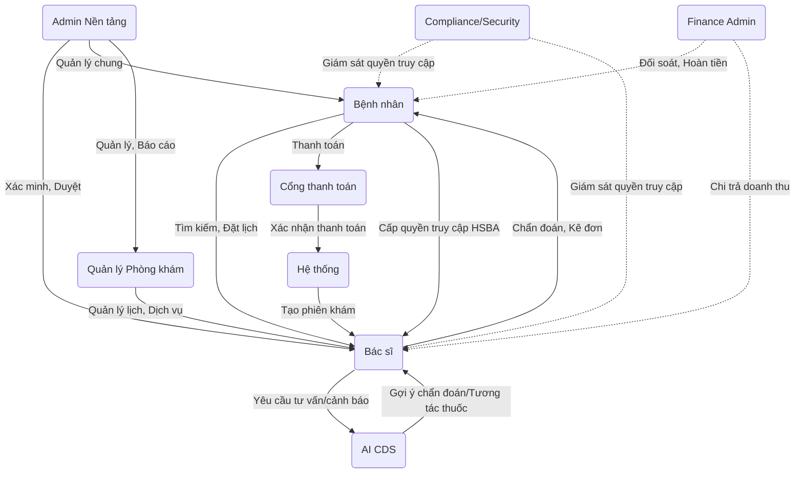

# Phân quyền và Vai trò (Roles) trong Healthcare Marketplace

Tài liệu này mô tả chi tiết các vai trò (roles) trong hệ thống Healthcare Marketplace, trách nhiệm của từng vai trò và mối quan hệ tương tác giữa chúng.

## 1. Các Vai trò chính (Core Roles)
Đây là các vai trò được định nghĩa trực tiếp trong cơ sở dữ liệu (`identity_service`) và có quyền đăng nhập vào hệ thống:

### 1.1. Bệnh nhân (PATIENT)
- **Mô tả:** Là người sử dụng cuối của dịch vụ, tham gia vào hệ thống để tìm kiếm dịch vụ y tế và bác sĩ.
- **Quyền hạn và Trách nhiệm chính:**
  - Quản lý hồ sơ cá nhân, xem thông tin dị ứng, bệnh nền, thuốc đang sử dụng do bác sĩ ghi nhận.
  - Tìm kiếm bác sĩ, xem lịch làm việc của bác sĩ.
  - Đặt lịch khám (appointment), thanh toán chi phí.
  - Tham gia tư vấn trực tuyến với bác sĩ, xem đơn thuốc sau khi khám.
  - Xem bệnh án điện tử, tài liệu y tế cá nhân và cấp quyền (consent) chia sẻ dữ liệu cho bác sĩ.

### 1.2. Bác sĩ (DOCTOR)
- **Mô tả:** Là các chuyên gia y tế cung cấp dịch vụ khám, tư vấn.
- **Quyền hạn và Trách nhiệm chính:**
  - Quản lý hồ sơ chuyên môn, upload giấy phép hành nghề.
  - Quản lý lịch làm việc, thiết lập giá và dịch vụ khám (nếu hoạt động độc lập).
  - Xem và cập nhật hồ sơ y tế bệnh nhân (thông tin dị ứng, bệnh nền, thuốc đang dùng) khi được cấp quyền.
  - Thực hiện phiên khám, tư vấn, tạo ghi chú lâm sàng (clinical notes), đưa ra chẩn đoán và kê đơn thuốc.
  - Nhận và tương tác với các cảnh báo từ hệ thống AI CDS (như tương tác thuốc, chẩn đoán phân biệt).

### 1.3. Admin Nền tảng (ADMIN)
- **Mô tả:** Quản trị viên cao cấp nhất, vận hành toàn bộ hệ thống Marketplace.
- **Quyền hạn và Trách nhiệm chính:**
  - Quản lý tài khoản (khóa/mở khóa) người dùng (Patient, Doctor, Provider Admin...).
  - Xét duyệt và xác minh hồ sơ giấy phép của bác sĩ/phòng khám.
  - Quản lý các giao dịch tài chính chung, dashboard hệ thống, khiếu nại.
  - Tạo và quản lý các dữ liệu danh mục chung (Ví dụ: danh sách Chuyên khoa).

### 1.4. Quản lý Phòng khám (PROVIDER_ADMIN)
- **Mô tả:** Người quản lý đại diện cho một tổ chức y tế, phòng khám hoặc bệnh viện trên nền tảng.
- **Quyền hạn và Trách nhiệm chính:**
  - Quản lý danh sách các bác sĩ thuộc phòng khám của mình.
  - Phân bổ lịch làm việc, thiết lập dịch vụ và giá khám cho cơ sở.
  - Xem báo cáo tổng quan về lịch hẹn và doanh thu của phòng khám.

---

## 2. Các Vai trò Mở rộng (Extended / Specialized Roles)
Trong quá trình mở rộng hệ thống (các phase tiếp theo), hệ thống có thêm các vai trò chuyên biệt (hiện có thể được bao gồm một phần trong quyền của ADMIN):

- **Finance Admin:** Chuyên trách xử lý tài chính (Đối soát thanh toán, phê duyệt hoàn tiền - refund, chi trả doanh thu - payout cho bác sĩ/phòng khám).
- **Compliance/Security Admin:** Kiểm soát tuân thủ pháp lý y tế và bảo mật. Quản lý Audit log, quyền truy cập dữ liệu nhạy cảm, giải quyết các sự cố rò rỉ dữ liệu (incident).

---

## 3. Các Vai trò Hệ thống (System Actors)
Đây không phải là người dùng thật mà là các hệ thống máy móc tương tác trực tiếp với luồng dữ liệu:

- **AI CDS System (Hệ thống Hỗ trợ quyết định lâm sàng AI):** Tương tác chủ yếu với bác sĩ. Nó tự động đọc kết quả xét nghiệm, phân tích đơn thuốc, sau đó sinh ra cảnh báo tương tác thuốc hoặc gợi ý chẩn đoán. AI không tự chẩn đoán mà chỉ là một "Trợ lý ảo" cho bác sĩ.
- **Payment Gateway (Cổng thanh toán):** Hệ thống bên ngoài (như Stripe, VNPay...) xử lý việc chuyển tiền, sau đó gửi Webhook về cho hệ thống để cập nhật trạng thái thanh toán (Paid/Failed) cho Lịch khám.

---

## 4. Mối quan hệ và Luồng tương tác giữa các Roles

### 4.1. Tương tác Bệnh nhân - Bác sĩ
Đây là mối quan hệ cốt lõi. Bệnh nhân tìm bác sĩ, đặt lịch và trả tiền. Sau đó hai bên tham gia tư vấn. Bác sĩ chỉ có quyền xem dữ liệu (Bệnh án, kết quả xét nghiệm) của bệnh nhân nếu bệnh nhân đã cấp quyền (Consent). Bác sĩ trả về cho bệnh nhân Đơn thuốc và Lời dặn dò.

### 4.2. Tương tác Bác sĩ - AI CDS
AI đóng vai trò như một người giám sát chuyên môn đứng sau bác sĩ. Bác sĩ đưa các thông tin đầu vào (triệu chứng, đơn thuốc dự định kê), AI phân tích dựa trên lịch sử bệnh án và trả về các cảnh báo (ví dụ: Thuốc A và Thuốc B đang tương tác xấu). Bác sĩ có quyền xem xét, sau đó *Chấp nhận (Accept)* hoặc *Bỏ qua (Ignore)* cảnh báo này, mọi thao tác đều được lưu log.

### 4.3. Tương tác Admin - Các Role khác
Admin Nền tảng đóng vai trò trọng tài. Bác sĩ tạo hồ sơ nhưng chưa thể hoạt động nếu Admin chưa kiểm tra chứng chỉ hành nghề và kích hoạt. Admin cũng có quyền đình chỉ bất kỳ Patient hay Doctor nào nếu vi phạm chính sách nền tảng. Provider Admin có quyền tương tự nhưng chỉ thu hẹp trong phạm vi cơ sở y tế của họ.
